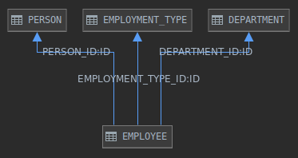

# Itera Java Home Assignment

The goal of this assignment is to have proven example of coding skills. Your goal is to implement missing functionality using given application skeleton. The code should be written using high quality standards, best practices and additional unit tests should exist for newly created code. High code coverage is a plus. You should work on this assignment alone (external documentation and StackOverflow is okay) and it should take you approx. 2 hours to complete (depending on your seniority it might be more or less).

## The assignment

You will work with simple HR application that tracks information about their employees. You will be given a database structure with sample data, which will be loaded into in-memory H2 instance on application start. The database schema can be described as this:

Project is implemented in Spring Boot and you will need to implement functionality to retrieve information from three REST endpoints, namely:

	GET /employee/{id}
	GET /employee/active
	GET /employee/active/by-department

> Note: employee is active when he does not have END_DATE set in EMPLOYEE table

## What is expected in solution

- implementation based on the API description using standard approach (separation of concerns, layering, error handling, etc.)
- tests in `EmployeeControllerTest` must pass
- additional tests for the implementation must be written
- public methods must have proper `JavaDoc`
- application can be run on port `4444` (as defined in `application.properties`) without any issues
- solution for this assignment is to be sent as a **compressed zip archive**